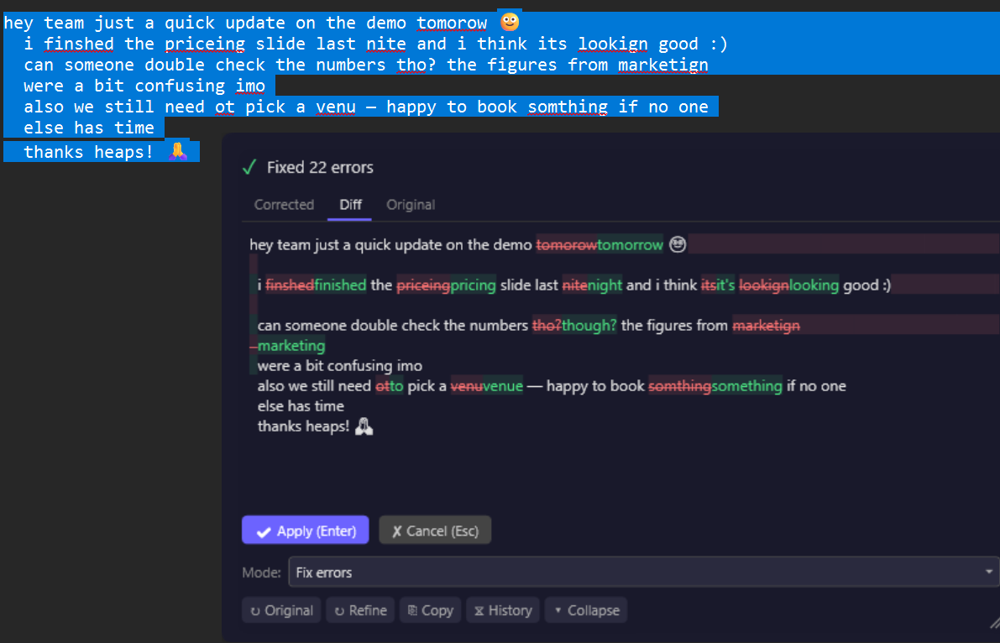
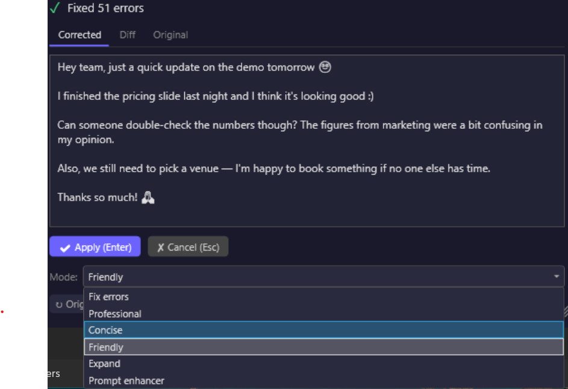
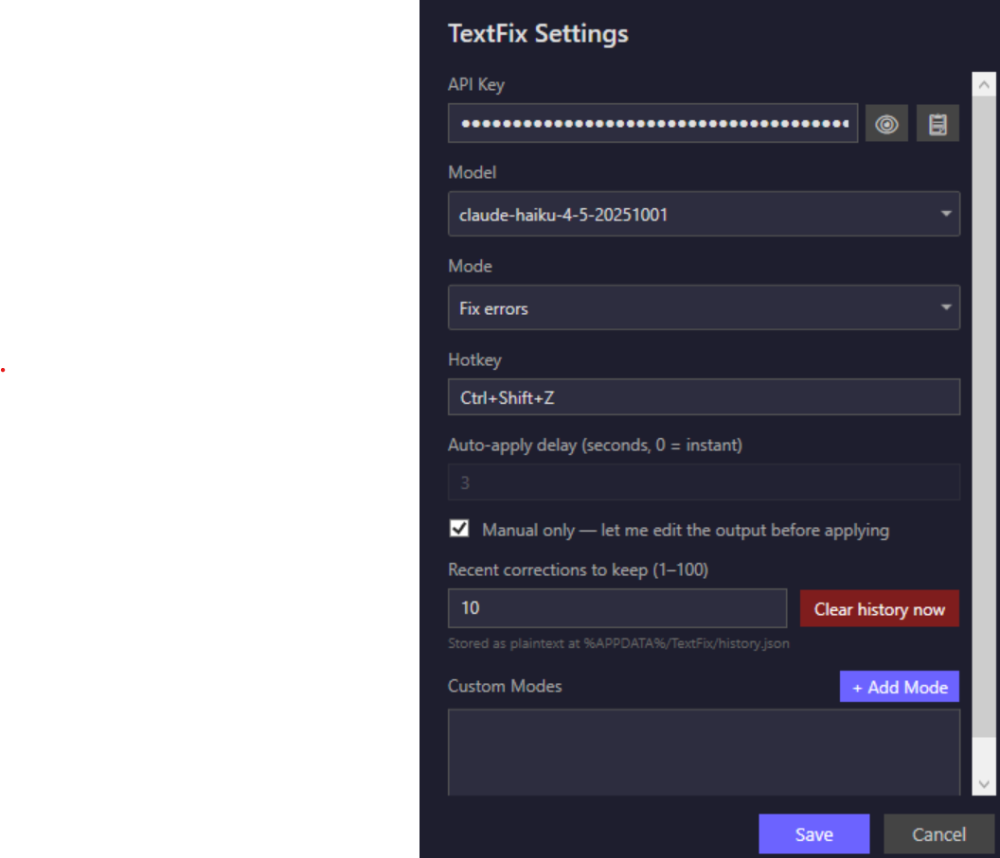

# TextFix

A lightweight Windows desktop app that corrects and improves your text using AI. Select text in any app, press a hotkey, and TextFix replaces it with the corrected version — no copy-pasting, no browser tabs, no context switching.



## How it works

1. Type or select text in any application (Teams, Outlook, Notepad, VS Code, a browser — anything)
2. Press **Ctrl+Shift+Z** (configurable)
3. A floating overlay appears showing the original vs. corrected text
4. Click **Apply** (or press Enter) to replace your text, or **Cancel** (Esc) to keep the original

TextFix uses the clipboard under the hood: it copies your selection, sends it to your chosen AI provider for correction, then pastes the result back — all in about a second.

## Features

- **Six built-in correction modes** — switch instantly from the overlay or system tray:
  - *Fix errors* — spelling, grammar, and typo fixes
  - *Professional* — polished business tone
  - *Concise* — trim filler and tighten prose
  - *Friendly* — warm, conversational rewrite
  - *Expand* — add detail and description
  - *Prompt enhancer* — rewrite text as an effective AI prompt
- **Custom modes** — define your own correction profile with a custom system prompt (add / edit / delete from Settings). Use it for tone-of-voice presets, domain-specific rewrites, or anything the built-ins don't cover.
- **Emoji and emoticons preserved** — `:)`, `:-D`, `🙂`, `🙏` and friends survive correction across every built-in mode.
- **Floating overlay** — three-tab result panel (Corrected / Diff / Original) with colored inline word diff, clickable Apply/Cancel buttons, auto-apply countdown, draggable, resizable, and a collapse toggle to peek behind it.
- **Correction history** — recent corrections available from the tray menu, click to copy. Limit is configurable; one-click wipe from tray or Settings for privacy.
- **Your choice of AI** — Anthropic, OpenAI, a local model via Ollama, or any OpenAI-compatible endpoint (LM Studio, llama.cpp, OpenRouter, Groq). Switch mid-session from the overlay's **Via** dropdown; each provider keeps its own model and key. See [Providers](#providers).
- **Runs fully offline** — with Ollama your text never leaves the machine, and there's no API key and no per-token cost.
- **Local stats** — open *About TextFix* from the tray to see lifetime corrections, time saved, per-mode breakdown, and this month's API spend estimate. All local; nothing is sent anywhere.
- **Everything is configurable** — hotkey, provider, model, default mode, auto-apply delay, manual-only mode (edit the AI output before applying), history retention, log verbosity, custom prompts. All stored in a single `settings.json` at `%APPDATA%/TextFix/`.
- **Auto-update** — Velopack pulls new releases in the background; install on next launch.
- **Single-file exe** — no installer dependencies, no .NET runtime required.



## Setup

### 1. Get an Anthropic API key

TextFix works with several AI providers — see [Providers](#providers) below. Anthropic's Claude is the default and the easiest place to start, and you bring your own key; nothing is sent to the developer. If you'd rather run everything locally with no key and no cost, skip to [Providers](#providers) and set up Ollama instead.

1. Go to [console.anthropic.com](https://console.anthropic.com) and create an account (or sign in if you have one). Free signup; you can use your existing Google/GitHub login.
2. Add a payment method or buy credits at [console.anthropic.com/settings/billing](https://console.anthropic.com/settings/billing). Anthropic requires this before the API will accept requests; the default Haiku model in TextFix is cheap (a typical correction costs a fraction of a cent — see the *About TextFix* dialog for your running spend).
3. Open [console.anthropic.com/settings/keys](https://console.anthropic.com/settings/keys) and click **Create Key**. Give it a name like "TextFix" so you can recognise it later.
4. **Copy the key now** — Anthropic only shows the full key once. It starts with `sk-ant-…`.
5. Keep the key on your clipboard; you'll paste it into TextFix in step 3.

If you ever want to revoke or rotate the key (e.g. it leaked, or you want to track TextFix usage separately), come back to the same Keys page.

### 2. Install TextFix

**Easiest:** grab the latest installer from the [Releases](../../releases) page. The first install is unsigned, so SmartScreen will warn the first time — click **More info** → **Run anyway**. Future updates install silently via the in-app updater.

**Or build from source** (requires [.NET 10 SDK](https://dotnet.microsoft.com/download/dotnet/10.0)):

```
git clone https://github.com/agnt-labs-oz/TextFix.git
cd TextFix
dotnet build
dotnet run --project src/TextFix/TextFix.csproj
```

### 3. Paste your key into Settings

On first run, the Settings window opens automatically. Leave **Provider** on Anthropic, paste your API key, pick a model (Claude Haiku is the default — fast and cheap), and close.

Prefer to run locally instead? Choose **Ollama (local)** here and follow [Providers](#providers) — there's no key to paste.



### 4. Try it

Select text in any app (Notepad is fine for a first try), press **Ctrl+Shift+Z**, and the overlay appears with the suggested correction.

To switch correction modes, right-click the tray icon and pick from the **Mode** submenu.

## Providers

TextFix can send your text to any of four provider types. Pick one in **Settings**, or switch on the fly from the **Via** dropdown in the overlay or the tray's **Provider** submenu. Each provider remembers its own model and key, so you can move between them without re-entering anything.

| Provider | API key | Cost | Notes |
|----------|---------|------|-------|
| **Anthropic** | Required | Per token | Claude Haiku / Sonnet / Opus. The default. |
| **Ollama (local)** | Not needed | Free | Runs on your machine. Nothing leaves it. |
| **OpenAI** | Required | Per token | GPT-4o, GPT-4o mini, o-series. |
| **Custom** | Optional | Depends | Any OpenAI-compatible endpoint. |

### Running locally with Ollama

No API key, no per-token cost, and your text never leaves the machine.

1. Install Ollama from [ollama.com](https://ollama.com).
2. Pull a model — a small one is plenty for text correction:
   ```
   ollama pull llama3.2:3b
   ```
3. In TextFix **Settings**, choose **Ollama (local)**. The base URL is prefilled as `http://localhost:11434/v1` and the API key field disappears — Ollama doesn't use one.
4. Click **↻** to load your pulled models, pick one, then **Test connection** to confirm.

The first correction after starting Ollama is slower — the model has to load into memory, which can take 10–20 seconds. The overlay shows a running timer and the time budget so you can tell loading from hanging. Later corrections are fast.

### Custom endpoints

**Custom (OpenAI-compatible)** covers anything speaking the `/v1/chat/completions` API — paste its base URL and, if it needs one, a key:

| Service | Base URL |
|---------|----------|
| LM Studio | `http://localhost:1234/v1` |
| llama.cpp server | `http://localhost:8080/v1` |
| OpenRouter | `https://openrouter.ai/api/v1` |
| Groq | `https://api.groq.com/openai/v1` |

Corporate gateways and self-hosted vLLM deployments work the same way.

### Configuration

All settings are stored at `%APPDATA%/TextFix/settings.json`. API keys are encrypted with Windows DPAPI — they never leave your machine in plaintext.

| Setting | Default | Notes |
|---------|---------|-------|
| Hotkey | Ctrl+Shift+Z | Any modifier+key combo |
| Provider | Anthropic | Anthropic, Ollama, OpenAI, or a custom endpoint |
| Model | claude-haiku-4-5 | Per provider. Local models are listed from your Ollama install |
| Default mode | Fix errors | Or any custom mode you've added |
| Auto-apply delay | 3 seconds | 0 = instant, or any non-negative integer |
| Manual only | Off | Disable auto-apply and edit the output before applying |
| Recent corrections | 10 | History size, 1–100. Wipe any time from Tray → Clear history… |
| Log level | Warn | Info / Warn / Error — bump to Info to capture per-correction events |
| Custom modes | — | Add / edit / delete from Settings |

### Privacy

- **API key**: encrypted at rest with Windows DPAPI (per-user, decrypted only by your Windows account).
- **Recent corrections**: the last N corrections (default 10, configurable) are stored as **plaintext JSON** at `%APPDATA%/TextFix/history.json` so you can copy a previous correction from the tray. This file is readable by any process running as your user. Wipe any time via **Tray → Clear history…** or the **Clear history now** button in Settings.
- **Logs**: a daily-rolling log at `%APPDATA%/TextFix/logs/` records lifecycle events, errors, and per-correction *counts* — never the text you correct. Retained 7 days, then deleted automatically.
- **Local stats**: aggregates shown in the *About TextFix* window come from `%APPDATA%/TextFix/stats.jsonl`. Append-only, local, never uploaded. Delete the file any time.
- **What's sent to your provider**: only the text you select when you press the hotkey. Nothing else is uploaded; no telemetry, no developer-side analytics. With **Ollama** or a local Custom endpoint, the text never leaves your machine at all — and TextFix records those corrections as costing $0.00 rather than guessing at a cloud rate.

## Suggest features / report bugs

- **Ideas** → [Discussions › Ideas](https://github.com/agnt-labs-oz/TextFix/discussions/categories/ideas)
- **Bugs** → [Issues](https://github.com/agnt-labs-oz/TextFix/issues/new/choose)
- Or click **Suggest a feature…** / **Report an issue…** in the tray menu — both pre-fill the right form.

## Support TextFix

TextFix is free and MIT-licensed. If it saves you time, you can leave a tip:

[☕ ko-fi.com/3smallwins](https://ko-fi.com/3smallwins)

## Roadmap

### Shipped

**Unreleased** — Multiple AI providers: Anthropic, local models via Ollama, OpenAI, and any OpenAI-compatible endpoint. Per-provider model and key, switchable from the overlay or tray. Connection test and model discovery in Settings. Elapsed-time counter during correction. Local inference correctly costed at zero.

**v0.8** — About dialog with local stats panel + Ko-fi support link, "Suggest a feature…" / "Report an issue…" / "Open log folder" / "About TextFix…" tray entries wired to GitHub Discussions/Issues, daily-rolling AppLog with 7-day retention, per-model cost estimator (Haiku/Sonnet/Opus), StatsTracker with JSONL aggregates.

**v0.7** — UI polish, privacy, HiDPI: configurable history limit + one-click privacy wipe, emoji and emoticon preservation in built-in modes, overlay clamps to the current monitor on HiDPI/scaled displays, collapse / expand toggle in the action row, privacy documentation, error log redaction.

**v0.6** — Three-tab result panel with colored inline word diff (red strikethrough for removals, green for additions). Word-level Myers/LCS over whitespace-preserving tokens.

**v0.5 / v0.4** — Velopack auto-update from GitHub Releases. Push a tag, get a single-file installer.

**v0.3** — Custom user-defined correction modes (CRUD in Settings). Inline refine. Editable output via "Manual only" mode. Scrollable Settings dialog.

**v0.2** — Preset correction modes, interactive overlay with clickable buttons, correction history, single-instance enforcement, dark-themed Settings, auto-apply countdown, pin toggle.

### Planned

- **Dictionary / thesaurus / inline lookup** — select a word, get a popover with definitions, synonyms, etymology, and pronunciation without leaving the app
- **In-app Ollama setup** — download and install Ollama, and pull a first model, without leaving TextFix
- **Google Gemini** — its API is not OpenAI-compatible, so it needs its own provider rather than a preset row
- **Real-time auto-correction** — monitor typing and correct as you go
- **Per-mode hotkey shortcuts** — bind a hotkey directly to a mode (e.g. Ctrl+Shift+P → Professional) to skip the mode picker
- **Streaming responses** — render the corrected text as it arrives, for faster perceived latency on long selections
- **Translation / language-learning mode** — translate selection, explain grammar nuances
- **Undo** — Ctrl+Z to revert the last applied correction

## Tech stack

- **.NET 10** / C# with WPF (UI) + WinForms (system tray NotifyIcon)
- **Anthropic C# SDK** for Claude API access
- **Plain `HttpClient`** for every other provider — Ollama, OpenAI, LM Studio, llama.cpp, OpenRouter and Groq all speak `/v1/chat/completions`, so one client covers them with no extra dependency
- **Win32 P/Invoke** via `LibraryImport` for global hotkeys, clipboard automation, focus tracking, and `SendInput`
- **DPAPI** for API key encryption at rest
- **Velopack** for unsigned single-file installer + auto-update
- **GitHub Actions** for automated releases — push a version tag and get a self-contained installer

## License

MIT
